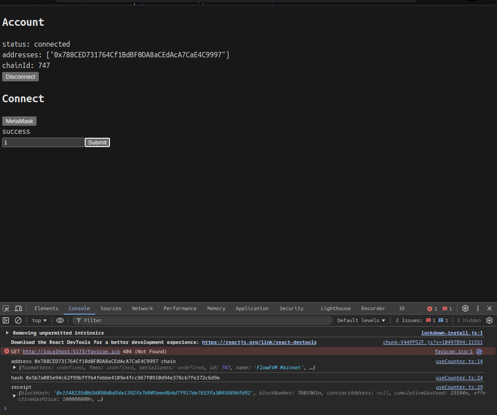
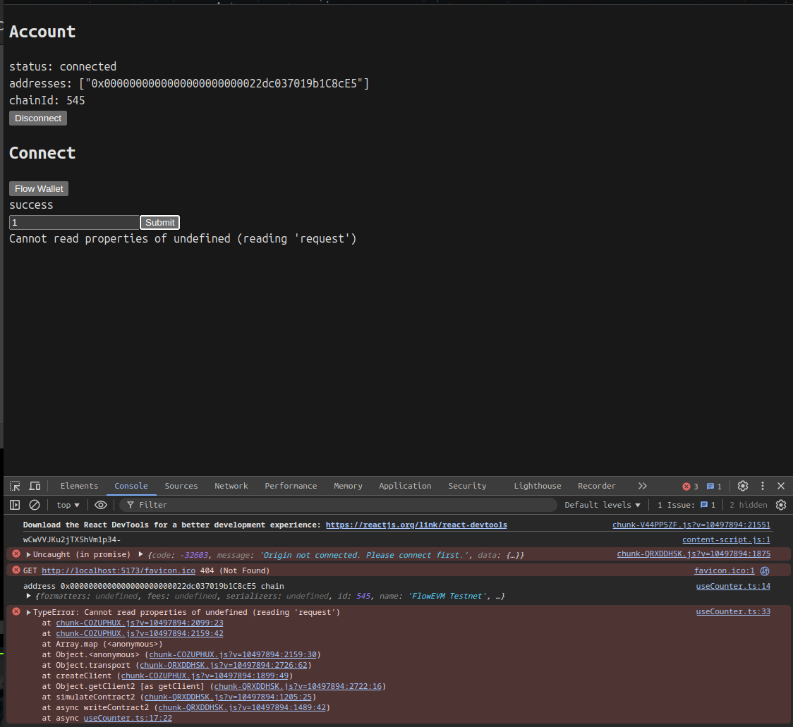

# Bug executing transaction with flow wallet

Minimal reproduction with the forge counter.sol contract demonstrating that one can setNumber with metamask, but receives a transaction error.

## How to reproduce
Use the flow wallet extension to connect 
attempt to set counter (tested on mainnet)
